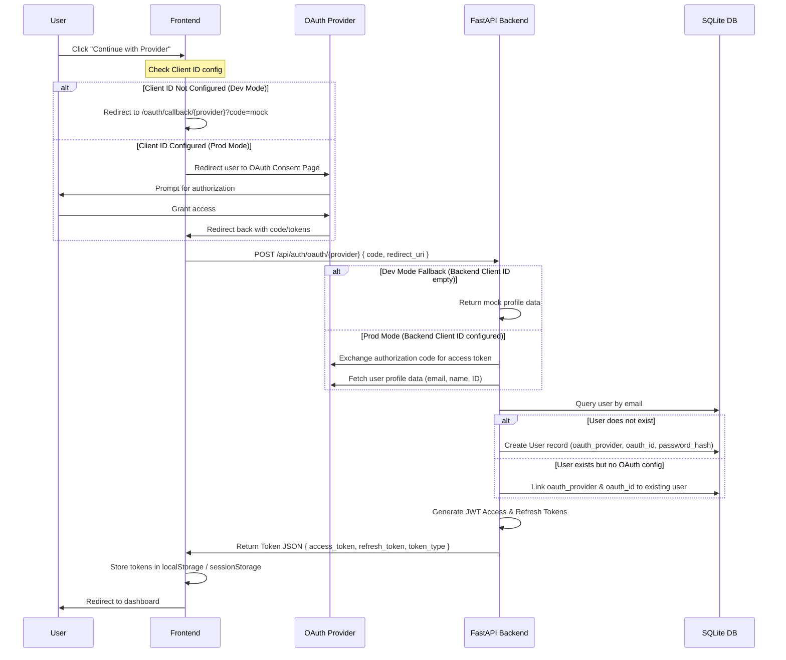

# Social Authentication Integration & Setup Guide

This guide describes how to configure Google OAuth, and GitHub OAuth for this AI Resume ATS application.

---

## 1. Provider Verification & Security Rules

To ensure production integrity and prevent unauthorized dashboard access:
1. **Frontend Validation**: The client-side application strictly verifies that provider Client IDs exist in the environment (`import.meta.env`) before initiating redirection. If a Client ID is missing, the frontend halts login and displays a prominent error message (e.g. `"Google login is not configured..."`).
2. **Backend Fallback**: The backend codebase maintains mock profile fallback routines for local testing of backend exchanges (when server credentials are empty). However, the frontend will not auto-bypass authentication or redirect to callbacks without genuine authorization keys unless explicitly configured, ensuring dashboard access is granted only after successful, genuine OAuth consent.

---

## 2. Environment Variables Configuration

Template environment files are provided as reference:
- Frontend: [`frontend/.env.example`](file:///c:/Users/SOHAM%20MANGROLIYA/OneDrive/Desktop/ATS_KIRO/frontend/.env.example)
- Backend: [`backend/.env.example`](file:///c:/Users/SOHAM%20MANGROLIYA/OneDrive/Desktop/ATS_KIRO/backend/.env.example)

To configure, rename the files to `.env` or append these variables to your existing `.env` files:

### Backend `.env`
```env
# Google OAuth
GOOGLE_CLIENT_ID=your_google_client_id.apps.googleusercontent.com
GOOGLE_CLIENT_SECRET=your_google_client_secret

# GitHub OAuth
GITHUB_CLIENT_ID=your_github_client_id
GITHUB_CLIENT_SECRET=your_github_client_secret


```

### Frontend `.env`
```env
VITE_GOOGLE_CLIENT_ID=your_google_client_id.apps.googleusercontent.com
VITE_GITHUB_CLIENT_ID=your_github_client_id

```

---

## 3. Provider Configurations Setup

### A. Google OAuth 2.0 Setup
1. Go to the [Google Cloud Console](https://console.cloud.google.com/).
2. Create or select a project.
3. Navigate to **APIs & Services > OAuth consent screen**:
   - Choose **External** user type.
   - Fill in the required application details.
   - Under Scopes, add `openid`, `email`, and `profile`.
4. Go to **APIs & Services > Credentials**:
   - Click **Create Credentials** and select **OAuth client ID**.
   - Select **Web application** as the Application Type.
   - Under **Authorized JavaScript origins**, add:
     - `http://localhost:5173` (Frontend dev server)
   - Under **Authorized redirect URIs**, add:
     - `http://localhost:5173/oauth/callback/google`
5. Copy the generated **Client ID** and **Client Secret** and add them to your env files.

### B. GitHub OAuth App Setup
1. Log in to [GitHub](https://github.com/) and go to your profile **Settings**.
2. On the left sidebar, click **Developer settings** > **OAuth Apps**.
3. Click **Register a new application**:
   - **Homepage URL**: `http://localhost:5173`
   - **Authorization callback URL**: `http://localhost:5173/oauth/callback/github`
4. Click **Register application**.
5. Copy the **Client ID**.
6. Click **Generate a new client secret** and copy it immediately.
7. Add both to your env files.


---

## 4. Technical Architecture Details

### A. Flow of Execution


### B. Security & Session Handling
- **Password Constraints**: For new social registrants, the database `password_hash` column is populated with a cryptographically secure, random 32-character hex string. This satisfies the SQLite `NOT NULL` constraint and secures the account from unauthorized password-based logins.
- **Access Tokens**: JWT Access tokens are signed using `HS256` with a default expiration of 30 minutes. They contain the user's email as the subject (`sub`) and are sent in the `Authorization: Bearer <token>` header for protected endpoints.
- **Refresh Tokens**: JWT Refresh tokens are signed similarly, with a default expiration of 7 days, allowing the frontend to silently query `/api/auth/refresh` when access tokens expire.
- **Cross-Provider Seamless Login**: If a user attempts to log in via a provider (e.g., GitHub) using an email that has already registered using a different provider (e.g., Google), the backend securely identifies the user by email and logs them in seamlessly, rather than blocking the attempt. (Note: Password-based accounts are still protected against OAuth auto-linking to prevent account hijacking).
